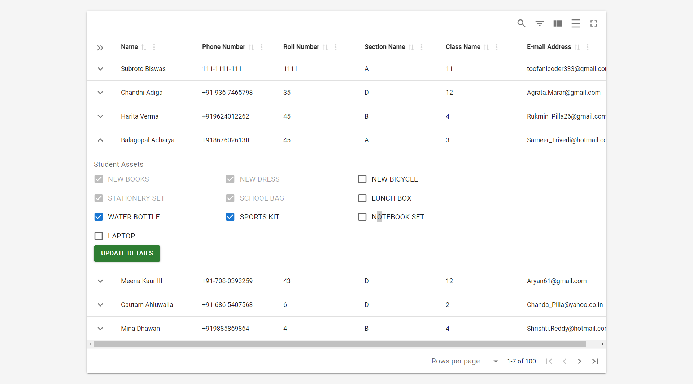

##  School Assets Management System

### 🎬 Demo

## 🧪 Technologies Used
- Strapi (backend)
- ReactJs with Vite
- Material UI 5
- React Hook Form
- Material React Table 2

## 💗 Acknowledgements
I would like to express my heartfelt thanks to the creators and contributors of the following packages for their incredible work and generosity in providing these free, open-source tools:

- Strapi (backend) 🛠️
- ReactJs with Vite ⚡
- Material UI 5 🎨
- React Hook Form 📋
- Material React Table 2 📊

Your efforts make development easier and more enjoyable for everyone. Thank you! 🙏🚀

## 📬 Contact Me 

Feel free to reach out to me! You can find me on the following platforms:

- 🌐 **Website:** [www.toofanicoder.in](https://www.toofanicoder.in)
- 📧 **Email:** [toofanicoder333@gmail.com](mailto:toofanicoder333@gmail.com)
- 🐦 **Twitter:** [@toofani_coder](https://twitter.com/toofani_coder)
- 📷 **Instagram:** [@toofani_coder](https://www.instagram.com/toofani_coder)
- 👔 **LinkedIn:** [https://www.linkedin.com/in/subroto-biswas-%F0%9F%AA%90-011893135/](https://www.linkedin.com/in/https://www.linkedin.com/in/subroto-biswas-%F0%9F%AA%90-011893135/)

Let's connect and chat! 😊